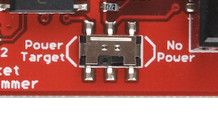
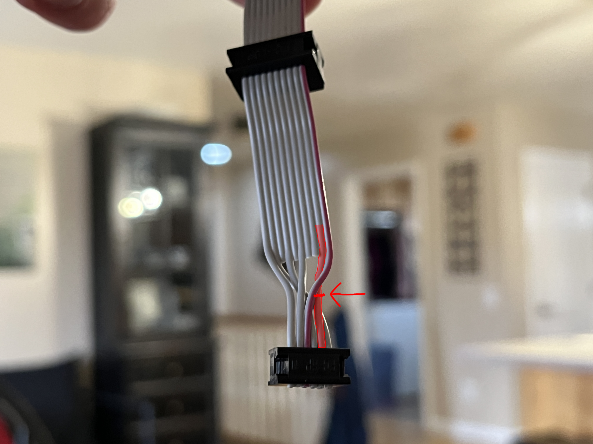
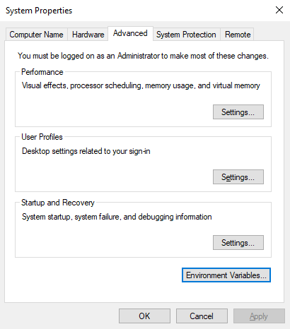
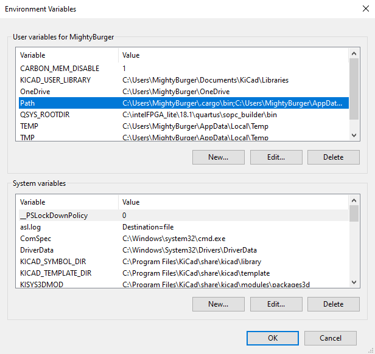
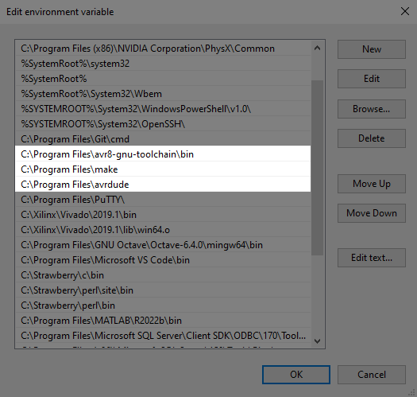
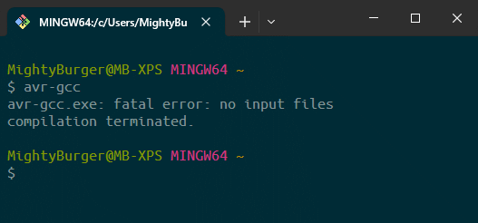
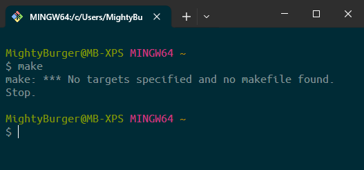

# rocket-rover

A repository for true gamers (the USU Spaceport 2023-2024 Payload team).

# Usage

On the [USB programmer](https://www.sparkfun.com/products/9825), set this switch to "No power," otherwise the programmer will power the microcontroller at 5 V which is above the data cube transceiver's maximum rated voltage.



(Image from [Sparkfun](https://learn.sparkfun.com/tutorials/pocket-avr-programmer-hookup-guide))

Cut the wire shown in the image below. Even with the programmer set to "No power," the power pin still carries a voltage above the transceiver's maximum rated voltage. It is recommended to do this for programmers used on the rover as well to protect its circuitry.



Then, plug in the USB programmer.

Open up some terminal, like Powershell or Command Prompt. My favorite is the Git Bash program that comes when you install [Git](https://git-scm.com/download/win).

Then, from within the repository:

- run `make <target>_all` to compile, fuse, and flash the microcontroller
- run `make <target>_compile` to just compile the program
- run `make <target>_fuse` to just set the microcontroller's fuses
- run `make <target>_flash` to just flash the program onto the microcontroller'
- run `make reset` to reset the microcontroller without writing anything to it or changing power state
- run `make clean` to delete the generated files

Where `<target>` is `rover` for the rover program, `cube` for the data cube program, or `trx` for the special data cube on the rover.

# Code structure

- The directory `rover/` is for the rover code. 
- The directory `cube/standalone/` is for the regular data cube code.
- The directory `cube/rover_trx/` is for the special data cube on the rover code.
- The directory `cube/common/` is for code used in both versions of the data cube.
- The directory `common/` is for code common to both the rover and the data cubes.
- The directory `build/` does not contain any code. It is used to store compilation results and can be ignored.

# Setup (Windows)

This section describes how to set everything up in Windows. 

To give you context so you know the reason behind these steps: when you run `make`, it runs these commands:

- `avr-gcc` to compile the code
- `avr-objcopy` to create a `.hex` file from the compiled code
- `avr-size` to tell you how much memory the program takes up
- `avrdude` to program the microcontroller using the `.hex` file

You will need all of these programs. Most of them are in the AVR toolchain.

### Install the AVR Toolchain

First, download the AVR 8-bit toolchain from Microchip's website [here](https://www.microchip.com/en-us/tools-resources/develop/microchip-studio/gcc-compilers).

Then, extract the contents somewhere. For example, I make a folder `C:\Program Files\avr8-gnu-toolchain\` and extracted everything there. (If you only want this under your specific Windows account, a great place is `C:\Users\<your username>\AppData\Local`).

Inside of the extracted folders, there should be a `bin` folder. You'll notice it has `avr-gcc.exe`, `avr-objcopy.exe`, `avr-size.exe`, and a few others. Let's add this `bin` folder to our `PATH` so we can run all these programs from the terminal.

To do this, search for "Edit environment variables" to get this window:



Find `Path` under System variables and click "Edit". (If you want it only under your specific Windows account, find `Path` under User variables instead.)
Don't delete anything that's already there, or you might break something.



Then, add the location.



You can test it worked by opening a terminal and running `avr-gcc`.



### Install Make

I think all you need is the `make.exe` program I put in the discord.

Make a folder for it like `C:\Program Files\make\` and put the executable file in there.

Repeat the steps from above to add `make` to the `PATH` variable.

Test by running `make` in a terminal.



You could also try following [this guide](https://leangaurav.medium.com/how-to-setup-install-gnu-make-on-windows-324480f1da69).

### Install avrdude

Grab the zip folder from Discord. It should have `avrdude.exe` and `avrdude.conf`.

(If you have Arduino IDE installed, you could also copy the executable from `C:\Program Files (x86)\Arduino\hardware\tools\avr\bin` instead of using my executable file on Discord. I don't remember where I got `avrdude.conf` but I think it's important.)

Make a folder for it like `C:\Program Files\avrdude` and extract the files in there.

Add it to your `PATH`, as before.

### Install the drivers

You need to install the drivers with the programmer plugged in.

Go to [this guide](https://learn.sparkfun.com/tutorials/pocket-avr-programmer-hookup-guide#installing-drivers) and follow the steps to install the driver.

I did it manually because I didn't want to install another program just to install a driver. Basically, I downloaded their zip file, then used Device Manager to install the driver from the zip file.

### Install Git

If you don't have Git, download it from [here](https://git-scm.com/download/win). (It will also come with a terminal program called Git Bash. I use it to run all my terminal commands.)

Then you need to give Git your Github credentials. In my opinion, the easiest way to do this is Github CLI, which you can grab [here](https://cli.github.com/). Run the installer. Then, open Git Bash and run `gh auth login`. Follow the steps. Choose `HTTPS` instead of `SSH` unless you know what you're doing.

Once you log in, you should be able to run the `git` commands on repos stored on Github. You might need to close and re-open the terminal first.

# Setup (Ubuntu)

Here's how to set up everything under Ubuntu.

Run these commands:

- `sudo apt-get update`
- `sudo apt-get install build-essential gcc-avr binutils-avr avr-libc gdb-avr avrdude git gh`

Run `gh auth login`. Choose `HTTPS`. Close and re-open the terminal.

If you are using WSL, you will have to perform the following steps. If you are running on a Linux system, skip the additional steps and jump straight to the Configuring to not Require Elevated Privileges section.

### Additional Setup for WSL2

- Follow the steps for installing the Windows driver under the Setup (Windows) section above.

You need to allow WSL to connect to USB devices in order to use the AVR Pocket Programmer. Follow the steps below to set this up. Alternatively, you can follow the same steps from Microsoft's website [here](https://learn.microsoft.com/en-us/windows/wsl/connect-usb).

- Install USBIPD-WIN from [here](https://github.com/dorssel/usbipd-win/releases) and run the .msi file.
- Open PowerShell as an administrator.
- Run `usbipd list` and note the bus ID of the USBtiny. You will have named this USB device when installing the Windows driver.
- Run `usbipd bind --busid <bus ID>`
- Run `usbipd list` and verify the USBtiny device state displays "Shared."

The above steps are persistent, but the following steps will need to be run every time you wish to use the AVR Pocket Programmer from a WSL terminal. If you unplug the USB device, you will need to perform these steps again. Attaching a USB device to WSL removes your ability to access the device from Windows. If you wish to access the USB device from Windows, you can unplug and replug the device.

- Open a WSL Ubuntu terminal.
- From a non-administrator PowerShell, run `usbipd attach --wsl --busid <bus ID>`
- Run `usbipd list` and verify the AVR Pocket Programmer device state displays "Attached."
- From Ubuntu, run `lsusb` and verify the USBtiny device name is listed.
- When you are done, if you want to unattach the USB device without unplugging it, run this command from a non-administrator PowerShell: `usbipd detach --busid <bus ID>`


### Configuring to not Require Elevated Privileges

You will need to use elevated privileges anytime you flash the microcontroller from Linux. The following steps will allow you to flash the microcontroller without using elevated privileges; they only need to be performed once.

- Run the command `groups` and verify that the current user is in the `plugdev` group. If `plugdev` is not listed, perform the following steps, otherwise skip them.
  - Run `sudo usermod -a -G plugdev <username>` replacing \<username\> with your Linux username.
  - Close and reopen the terminal.
- Using elevated privileges, create a file called `55-usbtiny.rules` in the directory `/etc/udev/rules.d`
- Using elevated privileges, copy the following line into the newly created file.\
```SUBSYSTEM=="usb", ATTRS{idVendor}=="1781", ATTRS{idProduct}=="0c9f", GROUP="plugdev", TAG+="uaccess"```
- Run `sudo /etc/init.d/udev restart`
- Unplug and replug the USB cable.
- If using WSL, from a non-administrator PowerShell terminal, run `usbipd attach --wsl --busid <bus ID>`

Congratulations, you are done.

